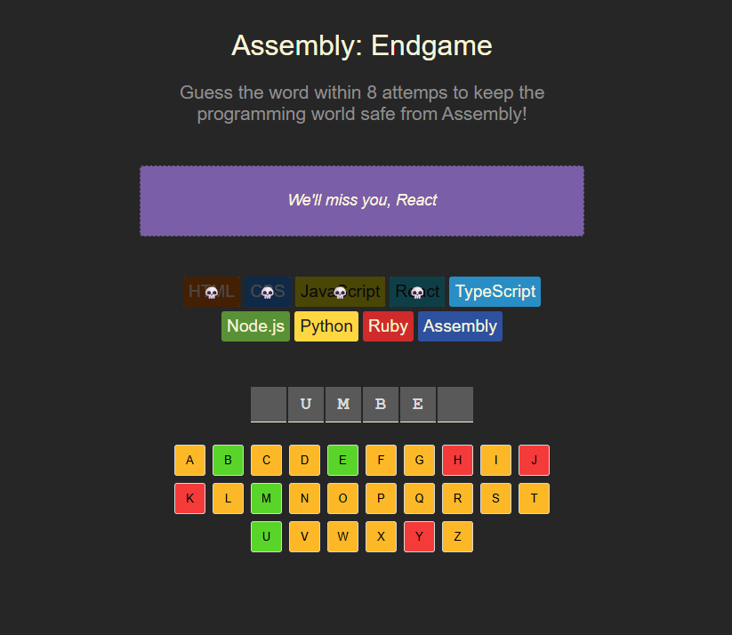

# ⚙️ Assembly: Endgame

> "Guess the word within 8 attempts to keep the programming world safe from Assembly!"

## 📚 About the project

This project is inspired by the [freeCodeCamp.org React JS full tutorial](https://youtu.be/bMknfKXIFA8) taught by **Bob Ziroll** in collaboration with **Scrimba**.

While the original idea comes from the final capstone game built in the course, **this version includes several improvements and refinements** added by me during implementation.

## ✨ Features

- 🎮 Interactive Hangman-style game using React
- 💾 Game state saved to `sessionStorage`
- 💬 Dynamic farewell messages when you guess wrong
- 🎉 Confetti celebration when you win
- ♻️ Reset button to start a new game
- ♿ Accessibility support for screen readers
- 🧠 Visual indicators for correct, wrong, and missing letters
- 🔥 Fade-out styling and game-over effects

## 🧩 Technologies used

- React
- Vite
- JavaScript (ES6+)
- CSS

## 🚀 Getting started

```bash
npm install
npm run dev
```

Then open your browser at `http://localhost:5173`

## 📁 Project structure

- `src/components` – Reusable UI components
- `languages.js` – List of programming languages used as health indicators
- `words.js` – Word list for guessing
- `utils.js` – Helper functions (`getRandomWord`, `getFarewellText`, etc.)

## 🖼 Screenshot

Add a screenshot of your game below:



## 🙋‍♂️ Author & modifications

Created and extended by **Jakub Strycharz** based on the final project idea from the freeCodeCamp x Scrimba React course.

Improvements added:
- Dynamic message management
- UX enhancements (animations, layout polish)
- Session storage persistence

---

Feel free to clone, fork, and play with it. Pull requests are welcome!
